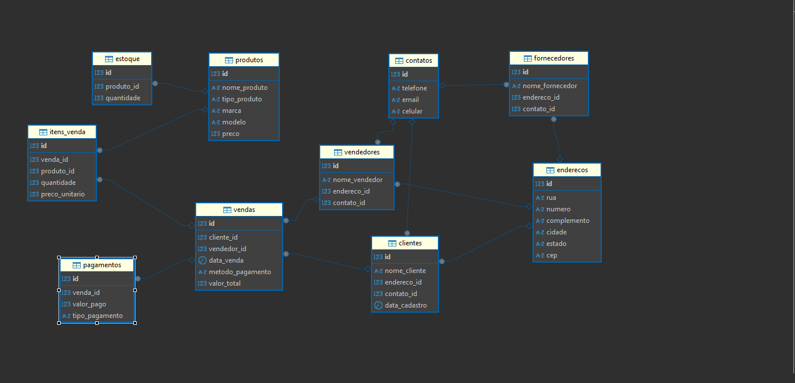

## Bikeshop

🚴‍♂️ BikeShop - Sistema de Gerenciamento🚀

Empresa: BikeShop
Visão Geral

A BikeShop é uma empresa especializada na venda de bicicletas e acessórios relacionados. Localizadoa em uma área urbana movimentada de Uberlândia, Minas Gerais, a empresa tem como objetivo oferecer uma variedade de bicicletas e acessórios de alta qualidade para ciclistas de todos os niveis, desde iniciantes até ciclistas expecientes e entusiastas.

Desafio:

A BikeShop está crescendo rapidamente e enfrenta desafios no gerenciamento eficiente de seus estoque, clientes e vendas. Atualmente, ekes estão registrando essas informações manualmente ou usando planilhas eletrônicas(Excel), o que se tornou ineficiente e propenso a erros. Eles reconhecem a necessidade de um sistema de banco de dados centralizados que possa armazenar e gerenciar essas informações de forma mais eficaz.

bjetivo do Sistema de Banco de Dados

Gerenciar o estoque de bicicletas e acessórios, incluindo detalhes como modelo,marca,quantidade em estoque preço de venda e fornecedor.

Manter um registro centralizado de cliente, incluindo informações como nome, endereço, número de telefone endereço de email e historico de compras.

Registrar e acompanhar as vendas de bicicletas e acessórios, incluindo detalhes como data de venda, produtos vendidos, preço de venda, método de pagamento e vendedor responsável

Abordagem Proposta:

A BikeShop planeja desenvolver um sistema de banco de dados personalizado usando tecnologias modernas de banco de dados, como MySQL ou ProtgreSQL. Eles planejam colaborar como desenvolvedores de software e especializados para projetar e implementar o sistema de acordo com seus requisitos e específicios. O sistema será acessado por funcionários autorizados por meio de uma interface de usuário intuitiva, onde poderão realizar todas as operações necessárias de forma eficiente.

Benefícios Esperados:

Melhoria na eficência operacional, permitindo que a BikeShop gerencie seu estoque, cliente e vendas de forma mais rápidas e precisa.

Maior satisfação do cliente, oferencendo um serviço mais personalizado e mantendo um histórico detalhado das interações anteriores.

Com um sistema de banco de ddos eficiente e bem projetado, a BikeShop está confiante de que poderá antender às demandas de seus clientes de maneira mais eficaz e continuar prosperando no mercado de bicicletas.

### Modelo conceitual 

### Base do Banco de Dados

